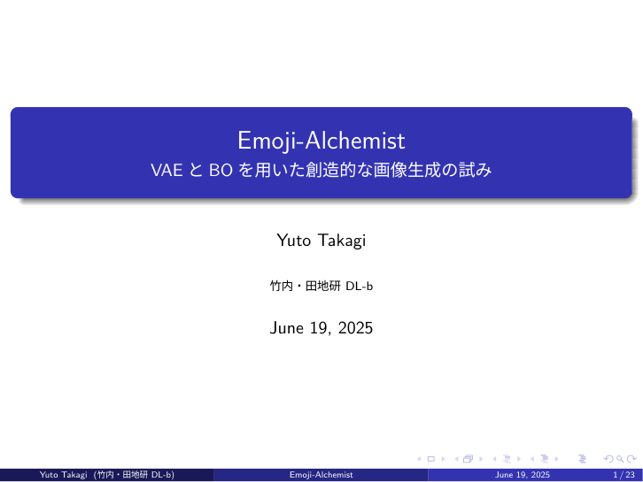
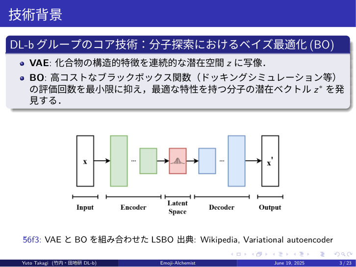
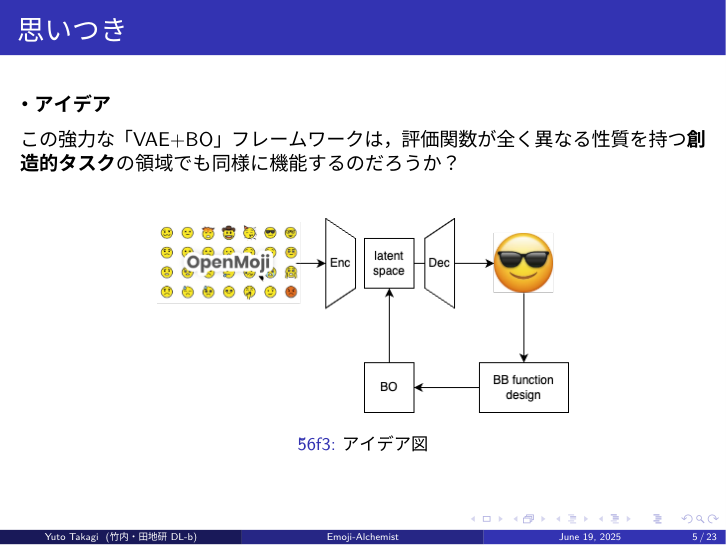
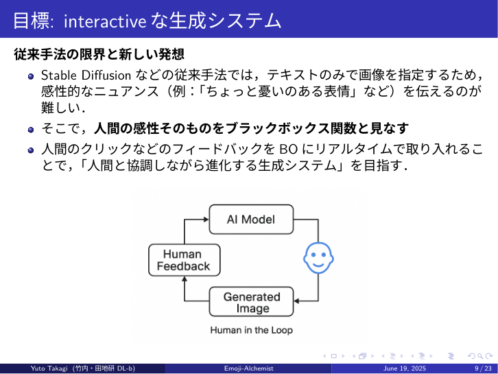
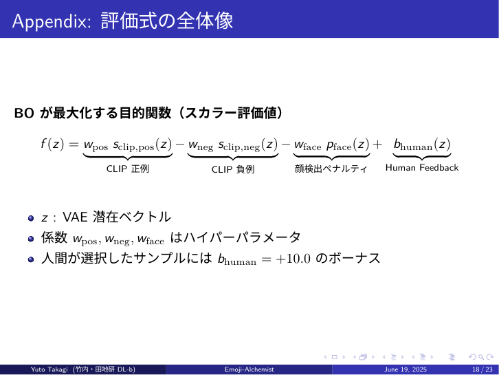
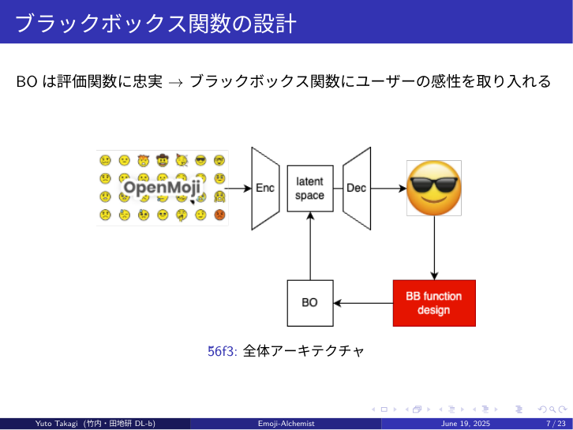
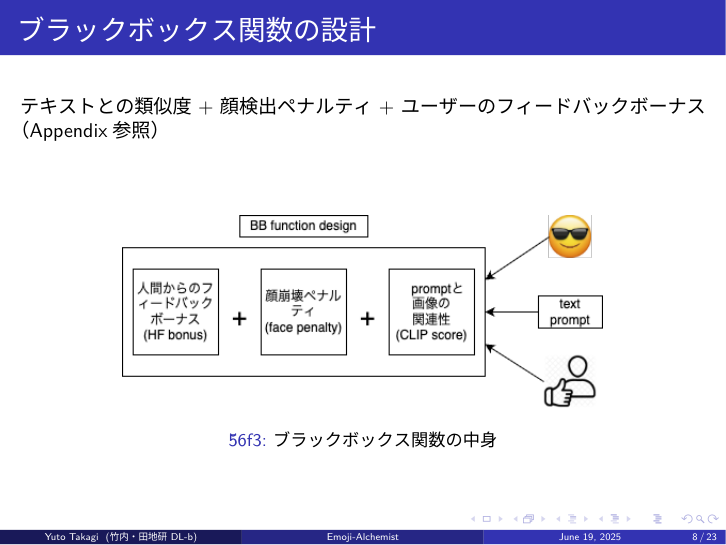
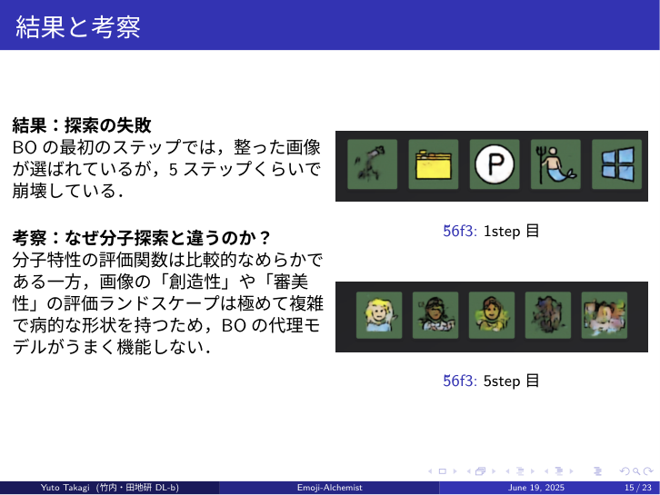

# Emoji Alchemist
*VAE + Bayesian Optimization powered, human‑in‑the‑loop emoji generator* 🌟


<p align="center">
  
</p>
  

## Table of Contents
- [🌟 Concept](#-concept)
- [🔬 Architecture & Technologies](#-architecture--technologies)
- [🚀 Demo](#-demo)
- [💡 Results & Discussion](#-results--discussion)
- [🏁 Conclusion](#-conclusion)
- [🛠️ Setup](#-setup)
- [📜 License](#-license)

## 🌟 Concept
Emoji-Alchemistは、テキストプロンプトと人間の感性を融合させ、新しい絵文字を錬成（生成）することを試みる実験的なプロジェクトです。

| background | Idea |
|----------|----------------------|
|  |  |

分子探索などの科学分野で強力な性能を発揮する「VAE（変分オートエンコーダ）+ BO（ベイズ最適化）」のフレームワークを、人間の「感性」が評価基準となる創造的な画像生成タスクに応用できるかを探求します．
このプロジェクトは，私が所属しているデータ駆動型システム研究グループの発表のためのものです．

人間のフィードバックをループに取り入れた、インタラクティブな画像生成アーキテクチャを目指しました

<p align="center">
  
</p>
### Conv-VAE (畳み込み変分オートエンコーダ)

高品質な絵文字データセットOpenMojiを学習し、絵文字の特徴を保持した潜在空間を構築します。この潜在空間内のベクトル（z）を操作することで、様々な絵文字画像を生成（デコード）できます。

### BO (ベイズ最適化)

評価関数の値を最大化する最適な潜在ベクトル z 
∗
  を、効率的に探索する役割を担います。評価コストが高いブラックボックス関数から最適な解を見つけ出すための強力な手法です。

### ブラックボックス評価関数

BOが最大化を目指す「評価スコア」を算出する関数です。この関数こそが、本プロジェクトの核となる「人間の感性」を取り込む部分です。
<p align="center">
  
</p>

スコア = (CLIPスコア) - (顔崩壊ペナルティ) + (人間からのフィードバックボーナス)

CLIPスコア: 生成画像がテキストプロンプト（例：「氷でできた青い絵文字」）にどれだけ類似しているかを評価します。

顔検出ペナルティ: 生成された画像が「顔」として認識できない場合にペナルティを与え、画像の崩壊を防ぎます。

Human Feedbackボーナス: ユーザーが「良い」とクリックした画像に高いボーナススコアを与え、探索の方向性をユーザーの好みに誘導します。

## 🔬 Architecture & Technologies
| Overview | Blackbox Fuction Design |
|----------|----------------------|
|  |  |

## 🚀 Demo
<p align="center">
  
</p>

インタラクティブな生成プロセス:

ユーザーがポジティブ/ネガティブプロンプトを入力します。

システムが潜在空間から候補となる画像を複数生成します。

ユーザーは、表示された画像の中から最もイメージに近いものをクリックします。

クリックという「フィードバック」が評価関数に組み込まれ、ベイズ最適化の代理モデルが更新されます。

更新されたモデルに基づき、AIはユーザーの好みをより反映した次の画像候補を提案します。

このループを繰り返すことで、AIは徐々にユーザーの感性に近づいていきます。

## 💡 Results & Discussion
<p align="center">
  
  <br>
  <em>BO はわずか数ステップで画像を崩壊させてしまう ―― なぜ？</em>
</p>

### VAE + BO アプローチの限界
実験の結果、本アプローチでは数ステップの最適化で画像が崩壊してしまう傾向が見られました。

これは、分子の特性（ドッキングスコアなど）の評価ランドスケープが比較的滑らかであるのに対し、画像の「創造性」や「審美性」の評価ランドスケープは極めて複雑で病的な形状を持つためだと考えられます。結果として、BOの代理モデルがうまく機能せず、最適化が困難になりました。

### 「生成＆ランク付け」への転換
この課題を受け、アプローチを転換しました。

生成 (Generate): まず、高品質な画像を大量に生成します。（例：VAEの潜在空間から1000個サンプリング）

ランク付け (Rank): 次に、評価関数を用いて全ての候補画像をスコアリングし、上位の結果をユーザーに提示します。

この「生成＆ランク付け」アーキテクチャは、画像の崩壊なく安定して多様な候補を生成できることが確認できました。これは、高品質な生成を担う生成モデルと、良し悪しを判断する評価モデルの役割を明確に分離する、現代的な生成AIの設計思想（例: Stable Diffusion）に通じるものです。

## 🏁 Conclusion
VAE+BOフレームワークは、評価関数が複雑で病的な創造的タスクへの直接的な適用には限界があることを実践的に示しました。

創造的タスクにおいては、最適点を探す**「探索」アプローチよりも、まず多様な候補を確保する「生成＆ランク付け」**アプローチの方が有効であるという知見を得ました。

この思想は、評価値の分布に比例した確率で多様な候補を生成するポリシーを学習するGFlowNetなど、より洗練されたアプローチにも繋がるものです。

## 🛠️ Setup
```bash
# 1. Clone the repository
git clone https://github.com/your-username/Emoji-Alchemist.git
cd Emoji-Alchemist

# 2. Install dependencies
pip install -r requirements.txt

# 3. Run the application
python app.py
```

---
## 📜 License
このプロジェクトは MIT License の下で公開されています。
